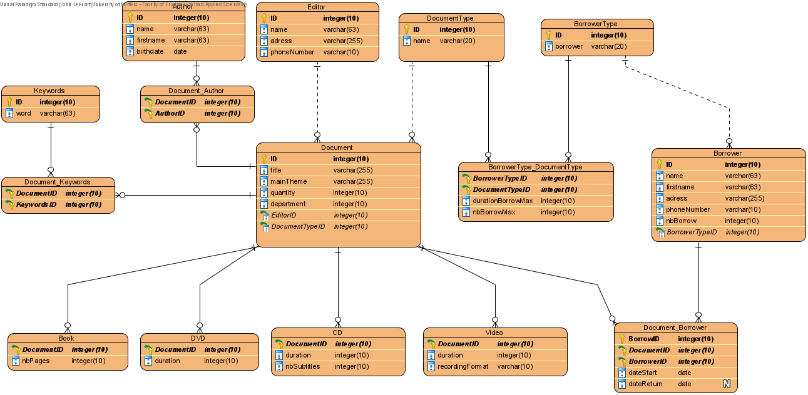

# Projet de base de données

Ce projet est à réaliser avant le 3 mai 2021, dans le cadre de l'Unité d'Enseignement "Bases de Données 2". Il porte sur la création et l'utilisation d'une base de données multimédia.

Composition de notre groupe : **Vincent Commin**, **Louis Leenart** & **Alexis Louail**.

La hiérarchie de notre projet est la suivante :
```bash
.
│
├───images                          # Images contenues dans README.md
│    ├─── entity_relationship.png   # Schéma entité association
│    └─── Projet_BDD2.png           # Schéma relationnel
│
├───src                             # Fichiers source
│    ├─── CreateBase.sql            # Créé les tables
│    ├─── DeleteBase.sql            # Supprime les tables
│    ├─── Inserting.sql             # Ajoute les données aux tables
│    ├─── Request.sql               # Requêtes du sujet
│    └─── Triggers.sql              # Ajoute les triggers
│
├───VisualParadigme                 # Fichiers de visual paradigme
│    └─── ...
├─── README.md                      # Ce fichier 
├─── README.pdf                     # README.md convertit en pdf
└─── sujet.pdf                      # Sujet du projet
```
# 1. Conception de la base de données multimédia

&nbsp;Voici le schéma entité association que nous avons réalisé pour le projet :


&nbsp;Grâce à ce schéma entité association, nous avons pu en déduire le schéma relationnel suivant :



## Problème rencontré

&nbsp;Durant la réalisation du schéma, nous nous sommes confrontés à un problème majeur qui été la gestion des documents. En effet la médiathèque propose plusieurs types de documents (dans un premier temps : vidéos, CD, DVD, livres). Ces différents documents ont la plupart de leurs champs en communs mais certains en ont en plus. 

&nbsp;Nous avons, dans un premiers temps, pensé à de l'héritage de table (comme pour de l'héritage en Programmation Orienté Objet). Cette technique n'était pas concluante car il aurait alors fallut mettre tous les champs de la table `Document` dans toutes les autres tables. Et donc, s'il nous faudrait rajouter un type de document, cela serait fastidieux. 
&nbsp;La deuxième solution qui nous est venue est d'attribuer une clé primaire unique qui se serait partagée entre tous les types de documents. Ainsi pour faire les requêtes il nous faut joindre tous les types de documents à chaque fois. La solution qui a été retenue est donc un mélange entre la clé primaire partagée avec `Document` et l'ajout d'une table `DocumentType` qui nous permet de connaître à l'avance le type du document.

# 2. Création de la base de données multimédia

&nbsp;L'initialisation (et manipulation) de la base de données se fait via les fichiers suivants :
```bash
.
└─── src
     ├─── CreateBase.sql    # Créé les tables
     └─── DeleteBase.sql    # Supprime les tables
```

# 3. Gestion des transactions

&nbsp;Pour gérer au mieux les transactions, nous avons décidé d'utiliser l'option d'AUTOCOMMIT disponible pour Oracle. Pour l'activer (pour SQLDevelopper), Tools > Preferences > Database > Advanced > Autocommit > Coché.

# 4. Vérification de la cohérence de la base

&nbsp;Pour la cohérence de la base de donnée nous nous sommes centrés autour de plusieurs points : 
1. Verification lors de l'emprunt si les exemplaires ne sont pas tous déjà empruntés (c'est-à-dire qu'au moins un exemplaire est disponible).
2. Le nombre d'emprunts maximal d'une personne (valeur dépendant de la catégorie de l'emprunteur et du document) qui ne doit pas être dépassé lors de l'emprunt d'un nouveau document.
3. Si un emprunteur est en retard pour la remise d'au moins un document, alors il ne peut pas en emprunter d'autres avant de le(s) avoir rendu(s).
4. A chaque ajout de document, il est nécessaire de déterminer le type auquel il appartient, pour l'ajouter dans la table correspondante.

&nbsp;Pour nous aider dans la création des triggers, nous les avons, au préalable, écrit en pseudo-code.

1. Vérification lors de l'emprunt si les exemplaires ne sont pas tous déjà empruntés (c'est-à-dire qu'au moins un exemplaire est disponible) :
```
A chaque ajout sur Document_borrower

    ->  Join entre Document et Document_borrower
        Where id du document = l'id du document que l'on souhaite emprunter,
              avec retour indéfini (donc null) 
              avec quantité du document > 0

    ->  Ensuite On compte le nombre de document total du Join précédent
        Si nombre de document empruntés < nombre total de document
        Alors L'emprunt est validé
        Sinon L'emprunt est refusé
```

2. Le nombre d'emprunt maximal d'une personne (valeur dépendant de la catégorie de l'emprunteur et du document) ne doit pas être dépassé avec l'emprunt d'un nouveau document.

```
A chaque ajout sur Document_borrower

	-> select sur Document 
        Récupération de la categorie du document ajouter en question

	-> Join entre Document_Borrower et Document
        Récupération de nbBorrow correspondant au nombre de document de la categorie du document en question grace au select precedent

    -> Join entre Borrower, BorrowerType, Document_Borrower, Document, DocumentType et BorrowerType_DocumentType
        Récupération de nbBorrow et nbBorrowMax du document/emprunteur en question
    
    ->  Si nbBorrow + 1 > nbBorrowMax
        Alors L'emprunt est refusé
        Sinon Mise à jour de nbBorrow (+1)
```

3. Si un emprunteur est en retard pour la remise d'au moins un document, alors il ne peut pas en emprunter d'autres avant de le(s) avoir rendu(s).

```
A chaque ajout sur Document_Borrower
    -> Select Count sur Document_Borrower
        Récupération du nombre de retard grace a la date du systeme et a la dateRETURN
    
    ->  Si compteur = 0
        Alors L'emprunt est validé
        Sinon L'emprunt est refusé     

```

4. A chaque ajout de document, il est nécessaire de déterminer le type auquel il appartient, pour l'ajouter dans la table correspondante.
```
A chaque ajout sur Document

    ->  Select entre Document et DocumentType
        Récupération de DocumentType.name 

    ->  Si DocumentType.name est egal a l'un des <nom_type_doc>
        Alors L'ajout est validé  et  fait dans la table <type_doc> associer
        Sinon L'ajout est refusé

(   Avec:
    <type_doc> => ["Book", "CD", "DVD", "Video"]
    <nom_type_doc> => ["livre", "cd", "dvd", "video"]
)
```

- **Important:** Pour chaque trigger dans `Triggers.sql`, nous avons mis en place des requetes de tests pour vérifier la mise en place de ces derniers. Pour le bon fonctionnement de ces tests, il faut les décommenter puis executer dans une base vide. Chaque trigger retrouvera ses tests juste en dessous de sa définition.
# 5. Remplissage de la base de données multimédia
&nbsp;Le remplissage de notre base de données est assurée par le fichier `src/Inserting.sql`, dans lequel on ajoute :
- Les types d'emprunteur `Personnel`, `Professionnel` et `Public`
- Les types de document `Livre`, `DVD`, `CD` et `Video`
- Des auteurs
- Des éditeurs
- Des emprunteurs
- Des documents
- Des emprunts

&nbsp;Pour rendre le remplissage plus facile, nous avons d'abord rempli la base de données via SQLdevelopper puis nous l'avons exporté dans un fichier sql.
# 6. Interrogation de la base de données multimédia
&nbsp;L'interrogation de la base de données multimédia est assurée par les requêtes contenues dans le fichier `src/Request.sql`. Les requêtes sont les suivantes :

## 1. Liste par ordre alphabétique des titres de documents dont le thème comprend le mot informatique ou mathématiques
```sql
SELECT title 
FROM Document 
WHERE 
    mainTheme = 'Informatique' OR 
    mainTheme = 'Mathématiques'
ORDER BY title;
```

## 2. Liste (titre et thème) des documents empruntés par Dupont entre le 15/11/2018 et le 15/11/2019
```sql
SELECT D.title, DB.dateStart
FROM Document D
JOIN Document_Borrower DB   ON DB.DocumentID = D.ID
JOIN Borrower B             ON B.ID = DB.BorrowerID
WHERE 
    B.name = 'Dupont' AND
    TO_DATE(DB.dateStart, 'DD/MM/YY') >= TO_DATE('15/11/18', 'DD/MM/YY') AND
    TO_DATE(DB.dateStart, 'DD/MM/YY') <= TO_DATE('15/11/19', 'DD/MM/YY');
```

## 3. Pour chaque emprunteur, donner la liste des titres des documents qu'il a empruntés avec le nom des auteurs pour chaque document
```sql
SELECT B.name, D.title, A.name
FROM Borrower B
JOIN Document_Borrower DB   ON DB.BorrowerID = B.ID
JOIN Document D             ON D.ID = DB.DocumentID
JOIN Document_Author DA     ON DA.DocumentID = D.ID
JOIN Author A               ON A.ID = DA.AuthorID
ORDER BY B.name;
```

## 4. Noms des auteurs ayant écrit un livre édité chez Dunod
```sql
SELECT D.title, E.name
FROM Document D
JOIN Editor E           ON E.ID = D.EditorID
JOIN Document_Author DA ON DA.DocumentID = D.ID
JOIN Author A           ON A.ID = DA.AuthorID
JOIN DocumentType DT    ON DT.ID = D.DocumentTypeID
WHERE
    E.name = 'Dunod' AND
    DT.name = 'Book';
```

## 5. Quantité totale des exemplaires édités chez Eyrolles
```sql
SELECT SUM(quantite)
FROM Document D
JOIN Editor E   ON E.ID = D.EditorID
WHERE E."name" = 'Eyrolles';
```

## 6. Pour chaque éditeur, nombre de documents présents à la bibliothèque
```sql
SELECT E.name, COUNT(D.title) AS "Nb docs"
FROM Document D
JOIN Editor E ON E.ID = D.EditorID
GROUP BY E.name;
```

## 7. Pour chaque document, nombre de fois où il a été emprunté
```sql
SELECT D.title, COUNT(DB.DocumentID) AS "Nb borrowing"
FROM Document D
JOIN Document_Borrower DB ON DB.DocumentID = D.ID
GROUP BY D.title;
```

## 8. Liste des éditeurs ayant édité plus de deux documents d'informatique ou de mathématiques
```sql
SELECT "nameEditor"
FROM
    (
        SELECT E.name AS "nameEditor", COUNT(D.title) AS "nbInfoMaths"
        FROM Document D
        JOIN Editor E ON E.ID = D.EditorID
        WHERE D.mainTheme = 'Informatique' OR D.mainTheme = 'Mathématiques'
        GROUP BY E.name
    )
WHERE "nbInfoMaths" >= 2;
```

## 9. Noms des emprunteurs habitant la même adresse que Dupont
```sql
SELECT B2.name, B2.firstname
FROM Borrower B1, Borrower B2
WHERE
    B1.name = 'Dupont' AND
    B1.adress = B2.adress
GROUP BY B2.name, B2.firstname;
```

## 10. Liste des éditeurs n'ayant pas édité de documents d'informatique
```sql
SELECT E.name
FROM Editor E
WHERE 
E.ID NOT IN
    (
        SELECT E.ID
        FROM Document D
        JOIN Editor E ON E.ID = D.EditorID
        WHERE mainTheme = 'Informatique'
        GROUP BY E.ID
    );
```

## 11. Noms des personnes n'ayant jamais emprunté de documents
```sql
SELECT name, firstname
FROM Borrower
WHERE
ID NOT IN
    (
        SELECT BorrowerID
        FROM Document_Borrower
        GROUP BY BorrowerID
    );
```

## 12. Liste des documents n'ayant jamais été empruntés
```sql
SELECT title
FROM Document
WHERE
ID NOT IN
    (
        SELECT DocumentID
        FROM Document_Borrower
        GROUP BY DocumentID
    );
```

## 13. Liste des emprunteurs (nom, prénom) appartenant à la catégorie des professionnels ayant emprunté au moins une fois un DVD au cours des 6 derniers mois
```sql
SELECT B.name, B.firstname
FROM Borrower B
JOIN BorrowerType BT        ON BT.ID = B.BorrowerTypeID
JOIN Document_Borrower DB   ON DB.BorrowerID = B.ID
JOIN Document D             ON D.ID = DB.DocumentID
JOIN DocumentType DT        ON DT.ID = D.DocumentTypeID
WHERE
    BT.Borrower = 'Professionnel' AND
    DT.name = 'DVD'               AND
    MONTHS_BETWEEN(DB.dateStart, SYSDATE) <= 6;
```

## 14. Liste des documents dont le nombre d'exemplaires est supérieur au nombre moyen d'exemplaires
```sql
SELECT title
FROM Document,
    (
        SELECT AVG(quantity) AS "avg"
        FROM Document
    )
WHERE quantity > "avg";
```

## 15. Noms des auteurs ayant écrit des documents d'informatique et de mathématiques (ceux qui ont écrit les deux)
```sql
SELECT name
FROM Author
WHERE
ID IN
    (
        SELECT AuthorID
        FROM Document_Author DA
        JOIN Document D ON D.ID = DA.DocumentID
        WHERE D.mainTheme = 'Mathématiques'
    ) AND
ID IN
    (
        SELECT AuthorID
        FROM Document_Author DA
        JOIN Document D ON D.ID = DA.DocumentID
        WHERE D.mainTheme = 'Informatique'
    );
```

## 16. Éditeur dont le nombre de documents empruntés est le plus grand
```sql
SELECT DISTINCT "EditorName", MAX("nbBorrow")
FROM
    (
        SELECT E.name AS "EditorName", COUNT(dateStart) AS "nbBorrow"
        FROM Document_Borrower DB
        JOIN Document D ON D.ID = DB.DocumentID
        JOIN Editor E   ON E.ID = D.EditorID
        GROUP BY E.name
    )
GROUP BY "EditorName";
```

## 17. Liste des documents n'ayant aucun mot cléf en commun avec le document dont le titre est "SQL pour les nuls"
Pour rendre les requetes plus lisibles, nous mettons en place des vues qui sont les suivantes:
```sql
-- Vue contenant les mots clés de SQL pour les nuls
CREATE OR REPLACE VIEW sql_pour_les_nuls_keywords AS
SELECT KeywordID, DocumentID
FROM Document_Keywords DK
JOIN Document D ON D.ID = DK.DocumentID
WHERE D.title = 'SQL pour les nuls';

-- Vue contenant les id des documents ayant au moins un mot clé en commun avec SQL pour les nuls
CREATE OR REPLACE VIEW docs_with_at_least_one_keyword_with_sql_pour_les_nuls AS
SELECT D.ID, D.title
FROM Document D
JOIN Document_Keywords DK ON DK.DocumentID = D.ID
WHERE
DK.KeywordID IN 
    (
        SELECT KeywordID FROM sql_pour_les_nuls_keywords
    );
```

```sql
SELECT title
FROM Document
WHERE
ID NOT IN
    (
        SELECT ID FROM docs_with_at_least_one_keyword_with_sql_pour_les_nuls  
    )
GROUP BY title;
```

## 18. Liste des documents ayant au moins un mot-clef en commun avec le document dont le titre est "SQL pour les nuls"
```sql
SELECT title 
FROM docs_with_at_least_one_keyword_with_sql_pour_les_nuls
GROUP BY title;
```

## 19. Liste des documents ayant au moins les mêmes mot-clef que le document dont le titre est "SQL pour les nuls"

Pour les deux prochaines requête, on créer un type `number_tt` qui est une table de number.

```sql
CREATE OR REPLACE TYPE number_tt AS TABLE OF NUMBER;
```

```sql
WITH document_keywords_agg(documentid, title, keywordlist, keywordids) AS (
    SELECT d.id, d.title
         , listagg(dk.keywordid, ', ') WITHIN GROUP (ORDER BY dk.keywordid)
         , CASE(COLLECT(dk.keywordid) AS number_tt)
    FROM   Document d
           JOIN document_keywords dk ON dk.documentid = d.id
    GROUP BY d.id, d.title
  )
SELECT dk1.title
FROM   document_keywords_agg dk1
       JOIN document_keywords_agg dk2
            ON dk2.keywordids submultiset OF dk1.keywordids
WHERE  
    dk2.documentid <> dk1.documentid AND
    dk2.title = 'SQL pour les nuls';
```

## 20. Liste des documents ayant exactement les mêmes mot-clef que le document dont le titre est "SQL pour les nuls"
```sql
WITH document_keywords_agg(documentid, title, keywordlist, keywordids) AS (
    SELECT d.id, d.title
         , listagg(dk.keywordid, ', ') WITHIN GROUP (ORDER BY dk.keywordid)
         , CAST(COLLECT(dk.keywordid) AS number_tt)
    FROM   Document d
           JOIN document_keywords dk ON dk.documentid = d.id
    GROUP BY d.id, d.title
  )
SELECT dk1.title
FROM   document_keywords_agg dk1
       JOIN document_keywords_agg dk2
            ON dk2.keywordids = dk1.keywordids
WHERE  
    dk2.documentid <> dk1.documentid AND
    dk2.title = 'SQL pour les nuls';
```

# 7. Optimisation des requêtes
## 1. Liste par ordre alphabétique des titres de documents dont le thème comprend le mot informatique ou mathématiques
Ici on pourrait mettre un index par hachage sur le `Document.mainTheme` étant donné une égalité stricte.
## 2. Liste (titre et thème) des documents empruntés par Dupont entre le 15/11/2018 et le 15/11/2019
Ici nous pourrions utiliser un Arbre-b sur la date `Document_Borrower.dateStart` étant donné les inégalités.
## 3. Pour chaque emprunteur, donner la liste des titres des documents qu'il a empruntés avec le nom des auteurs pour chaque document
Ici on a pas besoin d'index, la question pourra se poser sur la méthode de calcul de jointure utilisée.
## 4. Noms des auteurs ayant écrit un livre édité chez Dunod
Ici nous pouvons utiliser le hachage sur le nom de  l'éditeur et sur le nom du type de document. Mais ici aussi, vu le nombre de jointures. On peut se concentrer sur le calcul de la jointure. On peut aussi utiliser un index bitmap car `DocumentType.name` est un domaine restreint (ici 4 valeurs seulement).
## 5. Quantité totale des exemplaires édités chez Eyrolles
Ici on peut utiliser un hachage sur le nom de l'éditeur `Editor.name` grâce à une égalité stricte.
## 6. Pour chaque éditeur, nombre de documents présents à la bibliothèque
Ici nous n'avons pas besoin d'index.
## 7. Pour chaque document, nombre de fois où il a été emprunté
Ici nous n'avons pas besoin d'index.
## 8. Liste des éditeurs ayant édité plus de deux documents d'informatique ou de mathématiques
On peut ici utiliser un hachage sur `Document.mainTheme`.
## 9. Noms des emprunteurs habitant la même adresse que Dupont
Ici on peut mettre un index de hachage sur `Borrower.firstname`.
## 10. Liste des éditeurs n'ayant pas édité de documents d'informatique
Ici on peut mettre un index de hachage sur `Document.mainTheme` grâce à l'égalite stricte.
## 11. Noms des personnes n'ayant jamais emprunté de documents
Ici nous n'avons pas besoin d'index.
## 12. Liste des documents n'ayant jamais été empruntés
Ici nous n'avons pas besoin d'index.
## 13. Liste des emprunteurs (nom, prénom) appartenant à la catégorie des professionnels ayant emprunté au moins une fois un DVD au cours des 6 derniers mois
Ici nous pouvons mettre un index Arbre-b sur `Document_Borrower.dateStart`.
## 14. Liste des documents dont le nombre d'exemplaires est supérieur au nombre moyen d'exemplaires
Ici nous pouvons mettre un index Arbre-b sur `Document.quantity`.
## 15. Noms des auteurs ayant écrit des documents d'informatique et de mathématiques (ceux qui ont écrit les deux)
Ici nous pouvons mettre un index de hachage sur `Document.mainTheme` via les égalités strictes.
## 16. Éditeur dont le nombre de documents empruntés est le plus grand
Ici on peut se concentrer sur le calcul de la jointure plutôt que sur un index.
## 17. Liste des documents n'ayant aucun mot cléf en commun avec le document dont le titre est "SQL pour les nuls"
### Vue sql_pour_les_nuls_keywords
Ici on peut utiliser un index de hachage via l'égalité stricte.
## 18. Liste des documents ayant au moins un mot-clef en commun avec le document dont le titre est "SQL pour les nuls"
Ici on fait deux jointures, on peut donc se concentrer sur la technique de calcul des jointures.
## 19. Liste des documents ayant au moins les mêmes mot-clef que le document dont le titre est "SQL pour les nuls"
Ici nous pouvons mettre un index secondaire sur le nom des mots-clés pour accélérer la recherche de ceux-ci.
## 20. Liste des documents ayant exactement les mêmes mot-clef que le document dont le titre est "SQL pour les nuls"
Ici nous pouvons mettre un index secondaire sur le nom des mots-clés pour accélérer la recherche de ceux-ci.
